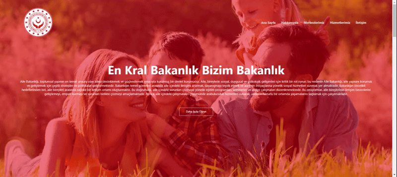

<h1> Educatıons </h1>

This project is an asynchronous JavaScript application created with Pokemon trading cards, allowing the search for specific characters.

<h2> The technologies used in the project </h2>

It was coded using HTML, CSS technologies.

<h2> screenshot </h2>

